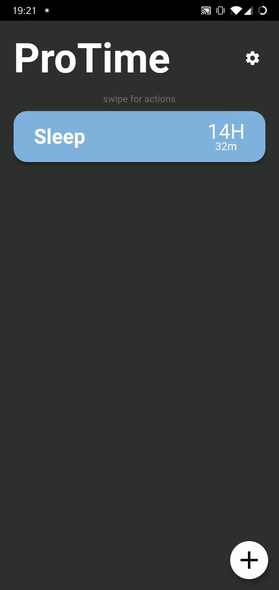

# ProTime

> Mobile application for tracking projects time

## Why? 

This app was born from the need of a simple and minimal solution to keep track of the times dedicated to personal projects.

## Usage example

## Download

**OR** you can download the latest *.apk* file [here](https://github.com/GiorgioBertolotti/ProTime/releases).  
**Note:** To install the *.apk* file on your Android device, you may have to [allow app installation from "Unknown Sources"](https://www.applivery.com/docs/troubleshooting/android-unknown-sources).

## Other

I made two videos while developing the app, you can find them here:
- [Part 1 (UI)](https://www.youtube.com/watch?v=ojH1lBEf5Zw&t=129s)
- [Part 2 (Logic)](https://www.youtube.com/watch?v=-Le0aDALDT8)

You can see the the Figma project [here](https://www.figma.com/file/VgnQ3jgQrJnlNsElcz3RRW/ProTime).

## License

